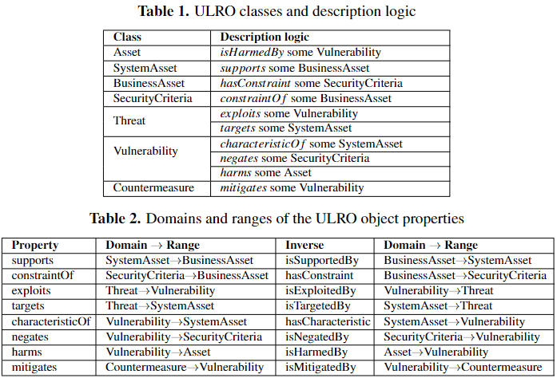

# Upper Level Reference Ontology (ULRO)

Upper-level reference ontology is a foundational and domain-independent ontology to encode information security concepts following the fundamental constructs of security risk management (SRM). The ULRO provides semantic interoperability, general concepts which are common to all domains, and enables a common foundation for ontologies in the information security domain. The ULRO presents a structural representation that can support the dynamic knowledge encoding and instantiation with an information security knowledge of domain-specific systems for SRM.

## ULRO Architecture
The ULRO defines the fundamental concepts of SRM, such as assets, security criteria, threats, vulnerabilities, countermeasures, and their relationships.

We use the Protege editor to code the concepts and relationships of ULRO using the web ontology language (OWL). The concepts are encoded as classes that illustrates the upper-level class hierarchies. Relationships in URLO present object properties that define the link between two concepts. For instance, an object property **exploits** linking the threat and  vulnerability concepts (*threat* ``exploits`` *vulnerability*). 

### Protégé Ontology Editor
[Download Protégé](https://protege.stanford.edu).