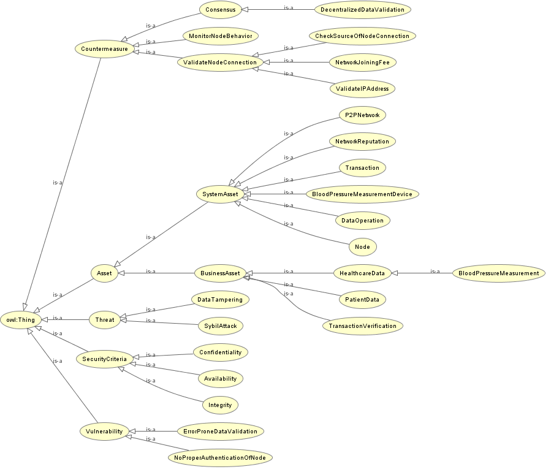

# Upper Level Reference Ontology (ULRO) Instantiation

We instantiated the [ULRO](https://github.com/mubashar-iqbal/upper-level-reference-ontology) with the data tampering threat and Sybil attack.

## SPARQL queries
The SPARQL queries can be used to retrieve information from an ULRO instantiation ontology. The following header code will remain the same for all the queries listed in this section.

```sql
PREFIX rdf: <http://www.w3.org/1999/02/22-rdf-syntax-ns#>
PREFIX owl: <http://www.w3.org/2002/07/owl#>
PREFIX rdfs: <http://www.w3.org/2000/01/rdf-schema#>
PREFIX xsd: <http://www.w3.org/2001/XMLSchema#>

PREFIX ULRO_INST: <https://mmisw.org/ont/~mubashar/ULRO-instantiation#>
```

### System assets
The following SPARQL query retrieves the system assets that support the business assets.

```sql
SELECT DISTINCT ?System_asset ?Business_asset WHERE {
    ?System_asset rdfs:subClassOf ULRO_INST:SystemAsset .
    ?System_asset rdfs:subClassOf ?Business_asset .
    ?Business_asset owl:onProperty ULRO_INST:supports .
}
```

### Business assets
The following SPARQL query gets the business assets that have the security criteria constraint.

```sql
SELECT DISTINCT ?Business_asset ?Constraint WHERE {
    ?Business_asset rdfs:subClassOf ULRO_INST:BusinessAsset .
    ?Business_asset rdfs:subClassOf ?Constraint .
    ?Constraint owl:onProperty ULRO_INST:hasConstraint .
    { ?Constraint owl:someValuesFrom ULRO_INST:Confidentiality . }
    UNION
    { ?Constraint owl:someValuesFrom ULRO_INST:Integrity . }
    UNION
    { ?Constraint owl:someValuesFrom ULRO_INST:Availability . }
}
```

### Threats mitigated
The following SPARQL query brings the threats that are mitigated by using the blockchain for a smart healthcare system. The query result shows the threats mitigated, associated vulnerabilities, and system assets that are targeted by the threats.

```sql
SELECT DISTINCT ?Threat ?Vulnerability ?System_asset WHERE {
    ?Threat rdfs:subClassOf ?Vulnerability .
    ?Threat rdfs:subClassOf ?System_asset .
    ?Vulnerability owl:onProperty ULRO_INST:exploits .
    ?System_asset owl:onProperty ULRO_INST:targets .
    ?Threat rdfs:seeAlso ?Domain .
    FILTER regex(?Domain, "^Mitigated")
}
```
### Threats appeared
The following SPARQL query brings the threats that are appeared within a blockchain-based smart healthcare system. The query result shows the threats appeared, associated vulnerabilities, and system assets that are targeted by the threats.

```sql
SELECT DISTINCT ?Threat ?Vulnerability ?System_asset WHERE {
    ?Threat rdfs:subClassOf ?Vulnerability .
    ?Threat rdfs:subClassOf ?System_asset .
    ?Vulnerability owl:onProperty ULRO_INST:exploits .
    ?System_asset owl:onProperty ULRO_INST:targets .
    ?Threat rdfs:seeAlso ?Domain .
    FILTER regex(?Domain, "^Appeared")
}
```

### Countermeasure
The following SPARQL query brings the list of countermeasures to mitigate the threats.

```sql
SELECT DISTINCT ?Countermeasure ?Vulnerability WHERE {
    ?Countermeasure rdfs:subClassOf ULRO_INST:Countermeasure .
    ?Countermeasure rdfs:subClassOf ?Vulnerability .
    ?Vulnerability owl:onProperty ULRO_INST:mitigates .
}
```

## Classification of ULRO instantiation
Protégé-based classification illustrates the class hierarchies along with their defined relationships.


### Class hierarchies

ULRO instantiation "is-a" based taxonomical structure illustrates the class hierarchies.



## How to use?
Download [Protégé](https://protege.stanford.edu) editor. Load/import [ULRO instantiation](https://mmisw.org/ont/~mubashar/ULRO-instantiation) in Protégé and navigate to the *Entities* tab. You can also execute the above-listed SPARQL queries to explore the encoded security risk management concepts.